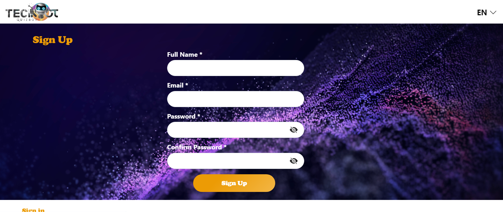
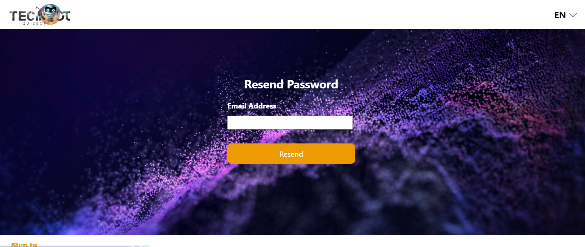
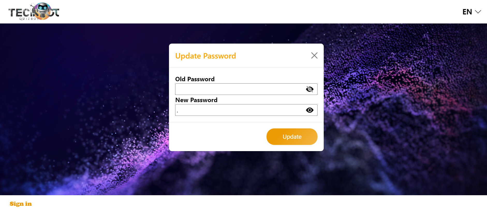
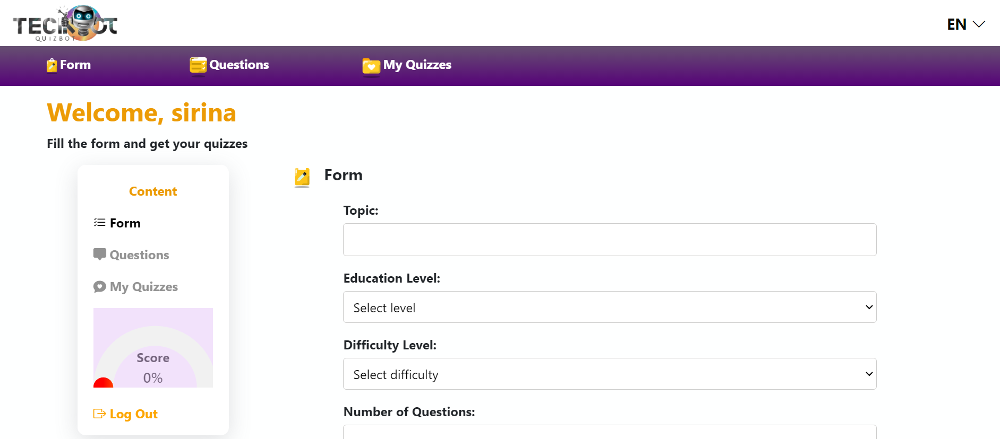
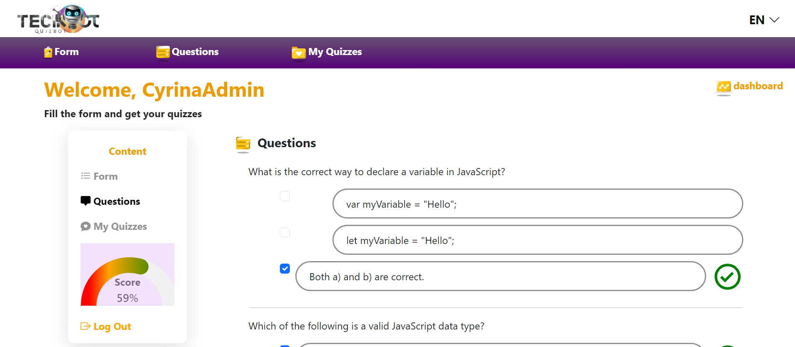
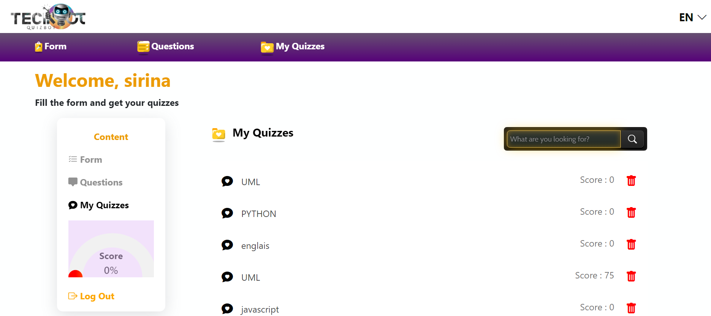
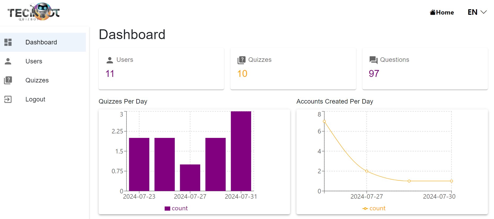
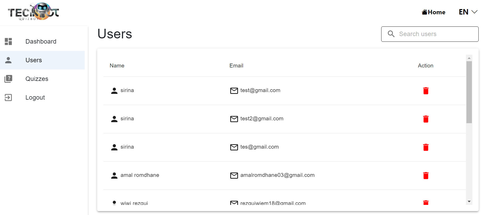
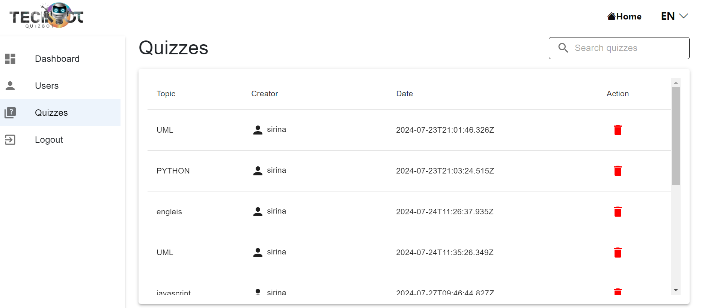

# Projet ReactJS et Express.js "QuizBot"
## Backend : Express.js 
``` npm i```
``` nodemon server.js```

## Frontend : ReactJS
``` npm i ```
``` npm start ```

## 📺 Video
https://youtu.be/_09BtfQqvzg?si=k-xP-HFZlAXZ40e8
## Interfaces du Projet












